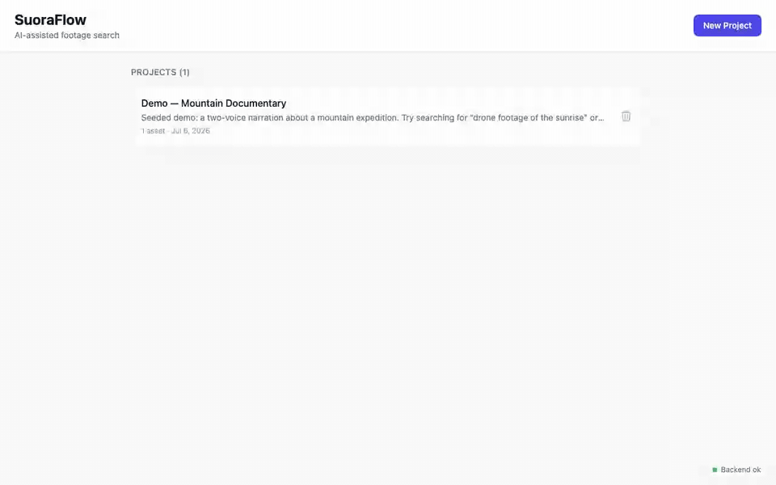

# SuoraFlow

[](https://github.com/Nikhilrangaa/suoraflow/actions/workflows/ci.yml)
[](LICENSE)
[](https://suoraflow.nikhilranga.dev)

> **▶ Try it live: [suoraflow.nikhilranga.dev](https://suoraflow.nikhilranga.dev)** — hosted demo
> (uploads capped at 100 MB; transcription runs on a small CPU instance, so processing is
> slower than a local install).

**AI-assisted footage search for video editors.** Upload raw audio/video, let a
local pipeline understand the speech in it, then search your footage by
*meaning* — "the part where they talk about the budget" — and assemble the hits
into an exportable rough-cut timeline.

Everything runs locally with one command. No cloud APIs, no accounts, no manual
model downloads.

```
VAD → ASR → speaker diarization → chunking → embeddings → vector search → rough cut
```



*Real footage (NASA Artemis I, public domain): a spoken search for “the most
powerful rocket in the world” finds the narrated moment; a visual search for
“rocket lifting off with flames and smoke” finds liftoff frames via CLIP —
then a click on a thumbnail opens the asset seeked to that exact moment.*

## Highlights

- **Audio-understanding pipeline** — FFmpeg extraction to mono 16 kHz WAV,
  Silero voice-activity detection (speech ratio + regions), faster-whisper
  transcription with word-level timestamps, optional pyannote speaker
  diarization, sentence-aware chunking, MiniLM embeddings in pgvector.
- **Semantic search** — query text is embedded with the same model and ranked
  by cosine similarity over an HNSW index; results are timestamped and
  click-to-seek.
- **Visual search (CLIP)** — video frames are sampled during processing and
  embedded with CLIP, so silent b-roll is searchable by what's *on screen*
  ("sunset over the ridge"), not just what was said. Search returns spoken
  matches and visual matches (with frame thumbnails) side by side.
- **Rough-cut timeline** — add search hits as clips, reorder, remove, and
  export the cut as JSON or CSV (source file + in/out points per clip).
- **Script-to-footage rough cut** — paste a script and each paragraph ("beat")
  is matched to footage via the transcript and visual indexes, then assembled
  into a timeline with a per-beat match report. With an `ANTHROPIC_API_KEY`
  set, candidates are reranked by a single Claude call; without one it falls
  back to pure embedding matching — the feature always works.
- **Audio-first UI** — waveform rendered from server-computed peaks,
  sample rate / channels / codec surfaced per asset, live pipeline status,
  clickable transcript that follows playback.
- **Local-first & reproducible** — one `docker compose up`; model weights are
  cached in a named volume (first run downloads ~1 GB, every run after is
  instant). Diarization is optional and degrades gracefully without a token.

## Quickstart

```bash
git clone <repo-url> suoraflow
cd suoraflow
cp .env.example .env          # review defaults; change passwords for production
docker compose up --build     # first run downloads models — be patient
```

Open **http://localhost:5173**. The API is at http://localhost:8000
(interactive docs at `/docs`).

### Try the demo (recommended first step)

```bash
docker compose run --rm worker python scripts/warm_models.py   # optional pre-warm
docker compose run --rm backend python scripts/seed_demo.py
```

This seeds a demo project with a committed 31-second narration clip plus a
silent b-roll video, and runs both through the full pipeline. Then, in the UI:

1. Open **Demo — Mountain Documentary** and watch the status badges move through
   `probing → extracting audio → detecting speech → transcribing → indexing → ready`.
2. Click the audio asset: player, waveform, audio metadata, and the transcript.
3. Back on the project page, search **“discussion about the budget”** — a
   *spoken* match with a ranked transcript chunk.
4. Search **“an orange sunset sky”** — a *visual* match: CLIP finds the scene
   in the silent b-roll from what's on screen, no speech needed.
5. Click **+ Timeline** on a result, reorder clips, then **Export CSV**.

## Architecture

```
Browser ── Vite/React SPA
              │ REST
              ▼
          FastAPI backend ───────── PostgreSQL 16 + pgvector
              │  enqueue                (assets, transcripts, embeddings)
              ▼
          Redis 7 + RQ
              │
              ▼
          RQ worker ── FFmpeg/ffprobe → Silero VAD → faster-whisper
                       → pyannote (optional) → sentence-transformers → pgvector
```

- **Statuses are persisted after every pipeline step**, so the UI polls and
  shows live progress: `uploaded → probing → extracting_audio → vad →
  transcribing → diarizing → chunking → embedding → indexing_visuals → ready`
  (or `failed` with a short, safe error message). Videos without an audio
  track skip the audio steps but still get a visual index.
- **Uploads are never trusted**: UUID server-side filenames, extension
  allow-list **and** ffprobe content validation, streamed to disk with a size
  cap, media stored outside any web-served directory.
- **Search** embeds the query with the same MiniLM model and ranks chunks by
  pgvector cosine distance under an HNSW index.

## Stack

| Layer | Tech |
|-------|------|
| Frontend | Vite + React 18 + TypeScript + Tailwind |
| API | FastAPI + SQLModel (Python 3.11) |
| Database | PostgreSQL 16 + pgvector (HNSW) |
| Queue | Redis 7 + RQ |
| Media | FFmpeg / ffprobe |
| ASR | faster-whisper (CPU, int8, `base` by default) |
| VAD | Silero (bundled with faster-whisper) |
| Diarization | pyannote.audio 3.1 — optional, gated on `HF_TOKEN` |
| Embeddings | sentence-transformers `all-MiniLM-L6-v2` (384-dim) |
| Visual search | CLIP `clip-ViT-B-32` (512-dim, image + text encoders) |

## API surface

```
POST   /api/projects                         GET  /api/projects
GET    /api/projects/{id}                    DELETE /api/projects/{id}
POST   /api/projects/{id}/assets/upload      GET  /api/projects/{id}/assets
GET    /api/assets/{id}                      GET  /api/assets/{id}/status
GET    /api/assets/{id}/transcript           GET  /api/assets/{id}/waveform
GET    /api/assets/{id}/media                DELETE /api/assets/{id}
POST   /api/projects/{id}/search             # {query, limit} → ranked chunks
POST   /api/projects/{id}/clips              GET  /api/projects/{id}/clips
POST   /api/projects/{id}/timelines          GET  /api/projects/{id}/timelines
POST   /api/projects/{id}/rough-cut          # {script, name?, candidates_per_beat?}
GET    /api/timelines/{id}
POST   /api/timelines/{id}/items             PATCH  /api/timelines/{id}/items/{item_id}
DELETE /api/timelines/{id}/items/{item_id}   GET  /api/timelines/{id}/export?format=json|csv
```

## Commands

| Task | Command |
|------|---------|
| Run everything | `docker compose up --build` |
| Seed the demo project | `docker compose run --rm backend python scripts/seed_demo.py` |
| Backend tests | `docker compose run --rm backend pytest -q` |
| Type-check frontend | `docker compose run --rm frontend npx tsc --noEmit` |
| Pre-warm model cache | `docker compose run --rm worker python scripts/warm_models.py` |
| Stop (keep data) | `docker compose down` |
| Full reset | `docker compose down -v` |

Backend source is bind-mounted into the containers, so code changes only need a
`docker compose restart backend worker` — no rebuild. The frontend hot-reloads.

## Environment variables

See `.env.example` for the full documented list. Key variables:

| Variable | Default | Description |
|----------|---------|-------------|
| `MAX_UPLOAD_MB` | `500` | Upload size limit |
| `WHISPER_MODEL` | `base` | faster-whisper size (`tiny`…`large-v3`) — bigger = better + slower |
| `HF_TOKEN` | *(empty)* | HuggingFace token enabling pyannote speaker diarization; leave blank and all segments are labelled "Speaker 1" |
| `ANTHROPIC_API_KEY` | *(empty)* | Anthropic key enabling Claude reranking for rough-cut generation; leave blank and rough cuts use embedding matching only |
| `RERANK_MODEL` | `claude-opus-5` | Claude model used for the rough-cut rerank call |
| `FRONTEND_URL` | `http://localhost:5173` | Allowed CORS origin (never a wildcard) |
| `STORAGE_ROOT` | `/storage` | Media + derived artifacts volume |

### Enabling speaker diarization (optional)

1. Accept the terms for [`pyannote/speaker-diarization-3.1`](https://huggingface.co/pyannote/speaker-diarization-3.1).
2. Put your token in `.env` as `HF_TOKEN=...`.
3. Install the extra dependency in the image: add `pyannote.audio==3.3.2` to
   the backend Dockerfile pip install (it is intentionally not shipped by
   default to keep the image lean), rebuild, and restart.

Without a token the pipeline still runs end to end — every segment is simply
attributed to "Speaker 1".

## Working with real footage

- Every common container/codec that FFmpeg can read works: `.mp4 .mov .mkv
  .avi .webm .mts .m2ts` video, `.mp3 .wav .aac .flac .ogg .m4a` audio.
- Transcription runs at well above realtime on modern CPUs with the `base`
  model. For an interview-heavy project, `WHISPER_MODEL=small` is a good
  accuracy upgrade if you can spare the compute.
- Video with no audio track (b-roll) is accepted and still becomes searchable
  through its visual index (CLIP frames) — it just has an empty transcript.
- Long footage is safe: jobs have a 3-hour timeout and the pipeline persists
  progress step by step.

## Repository layout

```
suoraflow/
  docker-compose.yml     # db, redis, backend, worker, frontend
  backend/
    app/
      models/            # SQLModel tables (Project, Asset, TranscriptSegment,
                         #   TextEmbedding, Clip, Timeline, TimelineItem)
      schemas/           # request/response models, separate from tables
      routes/            # thin handlers
      services/          # business logic (pipeline, search, timelines)
      workers/           # RQ queue + process_asset orchestration
      utils/             # ffmpeg, waveform peaks, upload validation
    tests/               # pytest suite (runs in the container)
  worker/                # RQ worker entrypoint
  frontend/src/          # pages, components, typed API client
  fixtures/              # committed demo clip used by seed_demo.py
  scripts/               # warm_models.py, seed_demo.py
  storage/               # (volume) raw/ + audio/ artifacts — never web-served
```

## License

[MIT](LICENSE)
